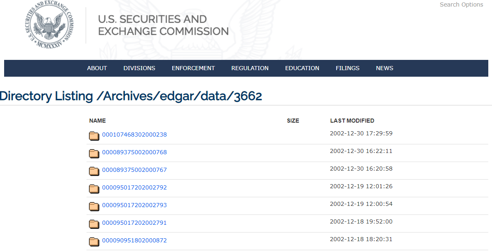

# Financial-Texts-Analysis-In-US-Securities-and-Exchange-Commision-Analysis-index.md

### Table of contents
* [Introduction](#introduction)
* [Problem Statement](#problem-statement)
* [Data Source](#data-source)
* [Technologies](#technologies)
* [Type of Data](#type-of-data)
* [Data Pre-processing](#data-pre-processing)
* [Tools Implemented](#algorithms-implemented)
* [Steps Involved](#steps-involved)
* [Evaluation Metrics](#evaluation-metrics)
* [Results and Conclusion](#results-and-conclusion)

### Introduction
Objective of this assignment is to extract some sections (which are mentioned below) from SEC / EDGAR financial reports and perform text analysis to compute variables those are explained below. Link to SEC / EDGAR financial reports are given in excel spreadsheet “cik_list.xlsx”. 

Please add https://www.sec.gov/Archives/ to every cells of column F (cik_list.xlsx) to access link to the financial report. 
Example: Row 2, column F contains edgar/data/3662/0000950170-98-000413.txt
Add https://www.sec.gov/Archives/ to form financial report link i.e. 
https://www.sec.gov/Archives/edgar/data/3662/0000950170-98-000413.txt 

### Problem Statement
* Build data pipeline to extract the Financial Texts from the US Security and Exchange Commissions website and perform NLP operations on the text. 

### Data Source
* The Dataset was obtained from the website US Security and Exchange Commisions Website: 
https://www.sec.gov/Archives/edgar/data/3662/

### Technologies
* Python 3.6.7

### Type of Data
* The data set consists of 150 records which has links provided to the US Security and Exchange Commissions Financial documents.
* The data does not contain any null values

### Data Pre-processing
* Tokenizing, removal of stop words and stemming was done for textual data

### Tools Implemented
* Vedar Rule-based model
* Pandas
* NLTK
* BeautifulSoup

### Steps Involved

STEP 1 : Loop through the file_rec. In every iteration we fetch url data from the SECFNAME column in the file_rec dataframe.

STEP 2 : In every iteration, We read the data from the HTML webpage using the URL Link 

STEP 3 : After reading the data from the HTML page, we remove the HTML components from it and get clean text data
         We concatenate all of that text data into a single string. 
         This has been done to avoid another loop inside it, thus increasing speed of operation
         
STEP 4 : Once the data is ready using the above operations, we then go for fetching specific sections data using the function fetch_sections_data()

STEP 5 : HOW IS THE SECTIONS DATA FETCHED ?
         The sections data is fetched using a very simple approach. For example: if we want to extract "RISK FACTORS" section data, this sections data
         would be present in the Table of Contents and in the main section where the Actual topic would be present.
         Since we would be needing only the Actual Topic data instead of the heading name in Table of contents, I am searching for the number of occurences
         of "RISK FACTORS"(UPPERCASE) in my data. I am looking only for UPPERCASE because the part where Actual data is present starts with "RISK FACTORS" name
         in the upper case only. So once I find the occurence of RISK FACTORS in my data, I slice my data to start it from that position. But where to end it now?
         To knoww the part where I have to end it is decided by the "ITEM"(UPPERCASE) name. Each section corresponds to one ITEM number. So RISK FACTORS corresponds to ITEM 2,
         its next topic should be ITEM 3. So I am looking for the position of ITEM in my sliced data. The part where ITEM begins would be my end point.
         But what if Table of contents also contains "RISK FACTORS" name in Upper case?
         Well for this case, I am removing the Table of Contents from my data.
         So, this would ensure that whatever data I am fetching is completely related to the section I am looking for.
         
STEP 6 : Once all the 3 sections data has been fetched, we perform all the required calculations on it.
  
### Evaluation Metrics  
Accuracy

### Results and Conclusion
By analyzing our dataset through various tools like Pandas, NLTK and BeautifulSoup in Python, we developed a data pipeline mechanism to automatically extract the Financila texts from the US Security and Exchnage commission and save the output in a .CSV file. 

